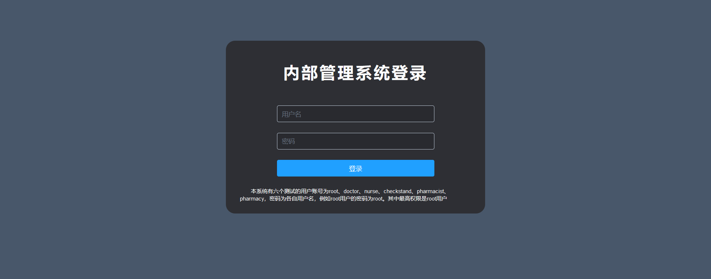
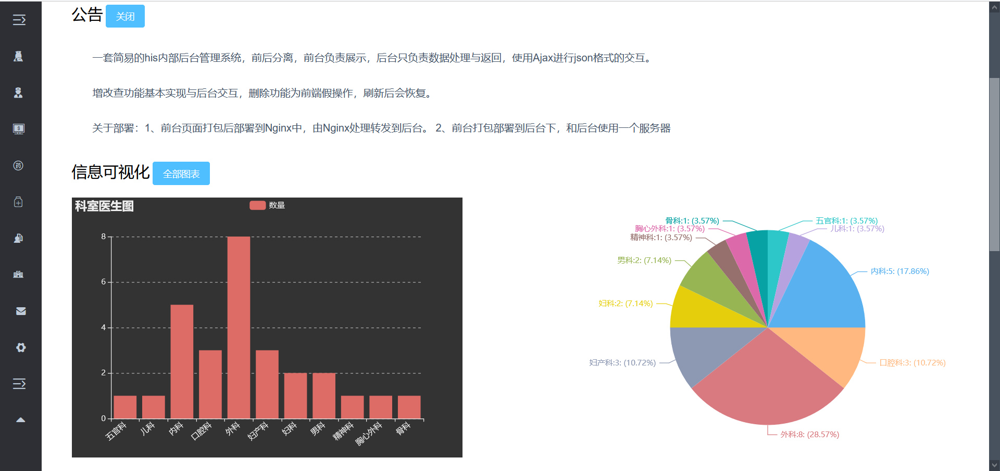
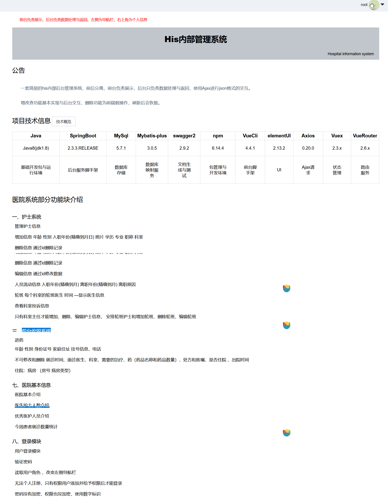
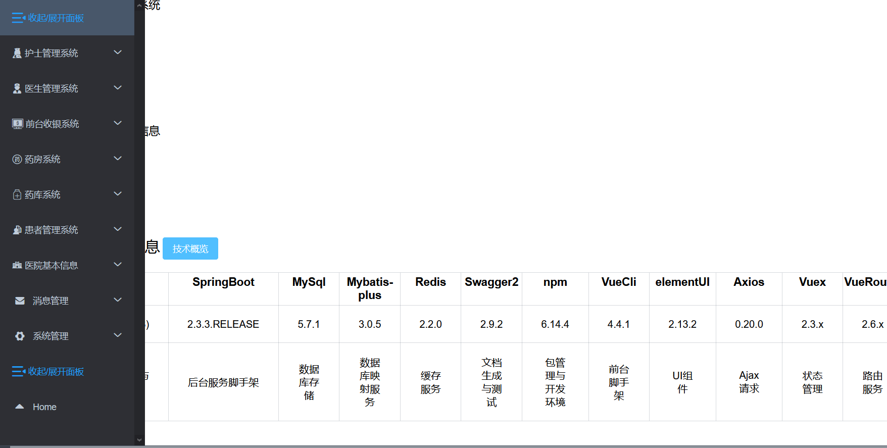
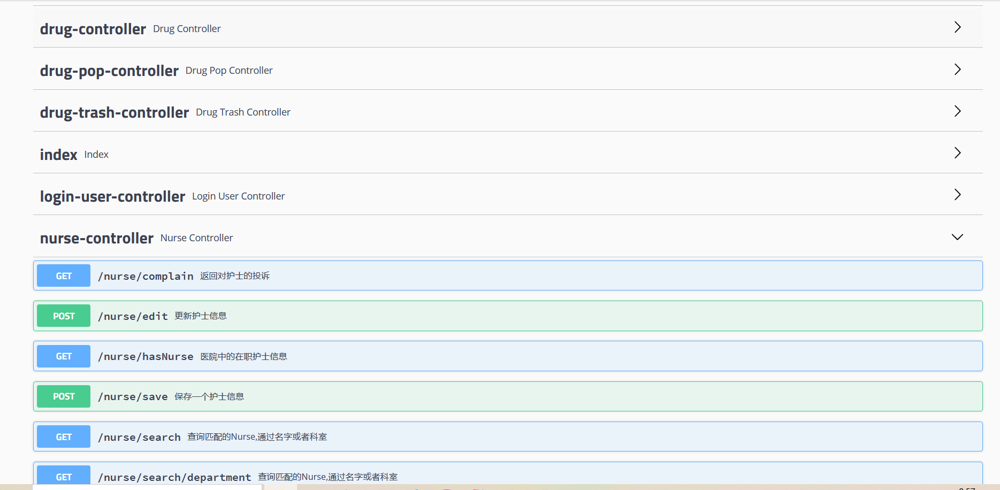

# curdInfo

A simple CURD informatization background(一个简单的curd的信息化后台).

一套简易的history 内部后台管理系统，实现了简单的curd操作，很简单。

增改查功能基本实现与后台交互，删除功能为前端假操作，刷新后会恢复。


### 模块

一、护士系统

二、医生系统

三、前台收银系统

四、药房系统

五、药库系统

六、患者模块

七、医院基本信息

八、登录模块

九、个人主页


### 开发技术

| Java                 | SpringBoot     | MySql      | Mybatis-plus   | Redis    | Swagger2       | npm              | VueCli     | elementUI | Axios    | Vuex     | VueRouter | echarts    |
| -------------------- | -------------- | ---------- | -------------- | -------- | -------------- | ---------------- | ---------- | --------- | -------- | -------- | --------- | ---------- |
| Java8(jdk1.8)        | 2.3.3.RELEASE  | 5.7.1      | 3.0.5          | 2.2.0    | 2.9.2          | 6.14.4           | 3.4.1      | 2.13.2    | 0.20.0   | 2.3.x    | 2.6.x     | 4.3.0      |
| 基础开发包与运行环境 | 后台服务脚手架 | 数据库存储 | 数据库映射服务 | 缓存服务 | 文档生成与测试 | 包管理与开发环境 | 前台脚手架 | UI组件    | Ajax请求 | 状态管理 | 路由服务  | 图表可视化 |


###   演示界面














##   启动

下载到本地后，分别下载依赖，配置好后台数据库，即可启动。

```shell
#1、下载npm依赖
npm install 
#2、开发模式运行vueCli
npm run dev

#1、下载maven依赖
mvn dependency:sources
#2、进入resources中的dev-yml中修改数据库ip

#3、运行SpringBoot脚手架
mvn spring-boot:run
```


项目结构

```shell
+---curdInfo-admin #后台
|   + 
|   \---src
|       +---main
|       |   +---java
|       |   |   \---com
|       |   |       \---his
|       |   |           \---app
|       |   |               +---component
|       |   |               +---config
|       |   |               +---controller
|       |   |               +---dao
|       |   |               +---entity
|       |   |               +---mapper
|       |   |               |   \---xml
|       |   |               +---pojo
|       |   |               +---service
|       |   |               |   \---impl
|       |   |               +---util
|       |   |               \---vo
\---curdInfo-front #前台
    +---build
    +---config
    +---img
    +---src
    |   +---api
    |   +---common
    |   |   +---fonts
    |   |   \---stylus
    |   +---components
    |   +---global
    |   +---router
    |   +---store
    |   \---vendor
    +---static
    |   \---css
```

